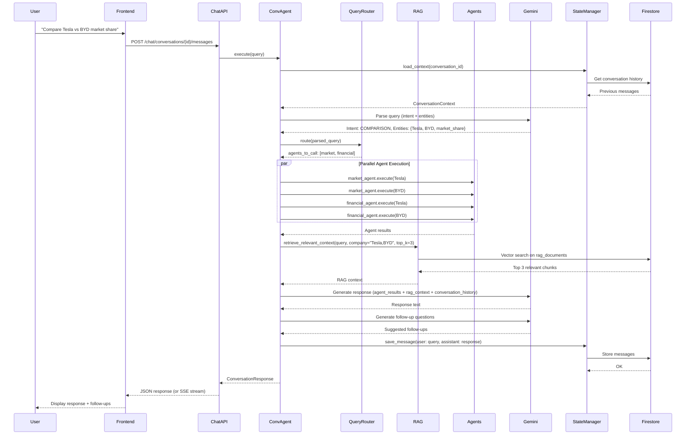
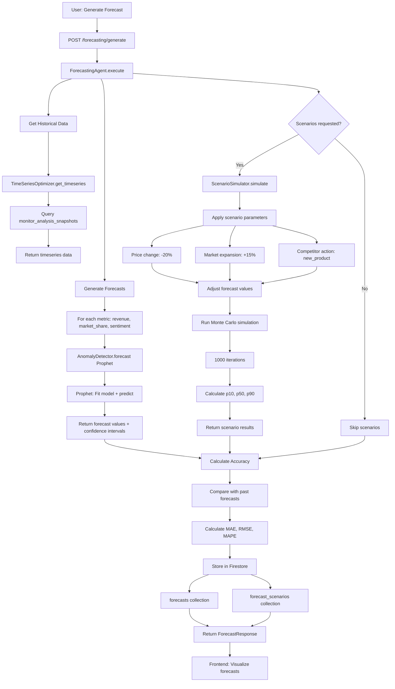
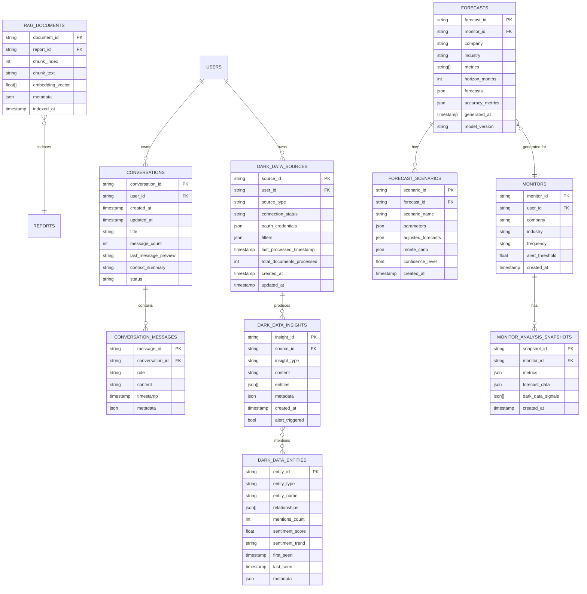

# Phase 1 Skills - Architecture Diagrams

Visual representations of the Phase 1 architecture using ASCII diagrams and Mermaid syntax.

---

## High-Level System Architecture

```
┌─────────────────────────────────────────────────────────────────────────────┐
│                              FRONTEND (Next.js 14)                           │
│  ┌─────────────┐    ┌──────────────────┐    ┌──────────────────────────┐  │
│  │   Chat UI   │    │  Forecasting UI  │    │  Dark Data Dashboard     │  │
│  │  (Streaming)│    │  (Visualizations)│    │  (Entity Graphs)         │  │
│  └──────┬──────┘    └────────┬─────────┘    └───────────┬──────────────┘  │
└─────────┼────────────────────┼──────────────────────────┼──────────────────┘
          │                    │                          │
          │ POST /chat/query   │ POST /forecasting/gen    │ POST /dark-data/extract
          │                    │                          │
          ▼                    ▼                          ▼
┌─────────────────────────────────────────────────────────────────────────────┐
│                        FASTAPI BACKEND (Cloud Run)                           │
│  ┌───────────────────────────────────────────────────────────────────────┐ │
│  │                         API LAYER (Thin)                               │ │
│  │  chat_endpoints.py │ forecasting_endpoints.py │ dark_data_endpoints.py│ │
│  │  - Validation      │ - Validation             │ - Validation          │ │
│  │  - Auth            │ - Auth                   │ - Auth                │ │
│  │  - Rate limiting   │ - Rate limiting          │ - Rate limiting       │ │
│  └────────┬──────────────────────┬────────────────────────┬───────────────┘ │
│           │                      │                        │                  │
│           ▼                      ▼                        ▼                  │
│  ┌────────────────┐   ┌──────────────────┐   ┌─────────────────────────┐  │
│  │Conversational  │   │  Forecasting     │   │  DarkData              │  │
│  │Agent           │   │  Agent           │   │  Agent                 │  │
│  │                │   │                  │   │                        │  │
│  │- Query parsing │   │- Prophet models  │   │- Data extraction       │  │
│  │- RAG retrieval │   │- Scenarios       │   │- NLP processing        │  │
│  │- Response gen  │   │- Monte Carlo     │   │- Entity tracking       │  │
│  └────────┬───────┘   └────────┬─────────┘   └──────────┬──────────────┘  │
│           │                    │                         │                  │
│           ▼                    ▼                         ▼                  │
│  ┌────────────────────────────────────────────────────────────────────────┐│
│  │               ANALYSIS ORCHESTRATOR (Extended)                          ││
│  │  Phase 1: Research + Market + Financial (parallel)                     ││
│  │  Phase 2: Framework (sequential)                                       ││
│  │  Phase 3: Synthesis (sequential)                                       ││
│  │  Phase 4: Conversational/Forecasting/DarkData (conditional)            ││
│  └────────┬──────────────────────┬─────────────────────┬──────────────────┘│
└───────────┼──────────────────────┼─────────────────────┼────────────────────┘
            │                      │                     │
            ▼                      ▼                     ▼
   ┌────────────────┐   ┌─────────────────────┐   ┌──────────────────┐
   │  RAG System    │   │ TimeSeriesOptimizer │   │ DataConnectors   │
   │  (Embeddings)  │   │ AnomalyDetector     │   │ (Gmail/Slack)    │
   │                │   │ (Prophet)           │   │                  │
   │- Generate emb  │   │- Get timeseries     │   │- OAuth2 flow     │
   │- Vector search │   │- Forecast           │   │- Extract docs    │
   │- Top-k retriev │   │- Anomaly detect     │   │- Transform       │
   └────────┬───────┘   └──────────┬──────────┘   └────────┬─────────┘
            │                      │                       │
            ▼                      ▼                       ▼
   ┌────────────────────────────────────────────────────────────────────┐
   │                        FIRESTORE DATABASE                           │
   │  ┌─────────────┐  ┌──────────┐  ┌──────────────┐  ┌────────────┐ │
   │  │conversations│  │forecasts │  │dark_data_    │  │(existing)  │ │
   │  │conv_messages│  │scenarios │  │sources       │  │monitors    │ │
   │  │rag_documents│  │          │  │insights      │  │reports     │ │
   │  │             │  │          │  │entities      │  │users       │ │
   │  └─────────────┘  └──────────┘  └──────────────┘  └────────────┘ │
   └────────────────────────────────────────────────────────────────────┘
```

---

## Skill 1: Conversational AI - Detailed Flow



---

## Skill 2: Predictive Analytics - Detailed Flow



---

## Skill 3: Dark Data Mining - Detailed Flow

```mermaid
graph LR
    A[Schedule Trigger] --> B[DarkDataAgent.execute]

    B --> C[Get Source Config]
    C --> D[Firestore: dark_data_sources]
    D --> E[OAuth credentials + filters]

    E --> F[DataConnectorFactory.create]
    F --> G{Source Type}

    G -->|Gmail| H[GmailConnector]
    G -->|Slack| I[SlackConnector]
    G -->|Drive| J[DriveConnector]
    G -->|Confluence| K[ConfluenceConnector]

    H --> L[Gmail API: List messages]
    I --> M[Slack API: conversations.history]
    J --> N[Drive API: files.list]
    K --> O[Confluence API: content.search]

    L --> P[Extract documents]
    M --> P
    N --> P
    O --> P

    P --> Q[Batch Processing 50 docs at a time]

    Q --> R[PrivacyManager.sanitize_batch]
    R --> S[PII Detection]
    S --> T{PII found?}
    T -->|Yes| U[Redact emails, phones, SSNs]
    T -->|No| V[No redaction needed]
    U --> W[Sanitized documents]
    V --> W

    W --> X[DarkDataProcessor.process_batch]
    X --> Y[Entity Extraction NLP]
    Y --> Z[Companies, People, Products]
    Z --> AA[Relationship Mapping]
    AA --> AB[Company-Person, Co-mentions]
    AB --> AC[Sentiment Analysis]
    AC --> AD[Per-entity sentiment over time]
    AD --> AE[Topic Modeling]
    AE --> AF[LDA/BERTopic for themes]
    AF --> AG[Trend Detection]
    AG --> AH[Emerging topics, sentiment shifts]

    AH --> AI[Generate Insights]
    AI --> AJ{Insight Type}
    AJ -->|Trend| AK[Store in dark_data_insights]
    AJ -->|Relationship| AL[Store in dark_data_insights]
    AJ -->|Sentiment Shift| AM[Store in dark_data_insights]
    AJ -->|Emerging Topic| AN[Store in dark_data_insights]

    Z --> AO[EntityTracker.update_entity]
    AO --> AP[Update dark_data_entities]
    AP --> AQ[Track mentions_count, sentiment_score]

    AK --> AR[IntelligenceMonitor.integrate_signals]
    AL --> AR
    AM --> AR
    AN --> AR

    AR --> AS{Alert threshold exceeded?}
    AS -->|Yes| AT[Generate Alert]
    AS -->|No| AU[No alert]

    AT --> AV[Notify User]
    AU --> AW[Update Source Metadata]
    AV --> AW

    AW --> AX[Firestore: last_processed_timestamp]
    AX --> AY[Return ExtractionResponse]
```



---

## Caching Architecture

```
┌─────────────────────────────────────────────────────────────────────┐
│                        CACHE HIERARCHY                               │
│                                                                      │
│  ┌────────────────────────────────────────────────────────────────┐│
│  │ Layer 1: In-Memory Cache (Python dict / Redis)                 ││
│  │ - Recent conversations (100 per user, TTL: 1h)                 ││
│  │ - Recent forecasts (50, TTL: 24h)                              ││
│  │ - Recent insights (100, TTL: 6h)                               ││
│  │ - Response time: <10ms                                         ││
│  │ - Hit rate target: >70%                                        ││
│  └────────────────────────────────────────────────────────────────┘│
│                              ↓ Cache miss                            │
│  ┌────────────────────────────────────────────────────────────────┐│
│  │ Layer 2: Disk Cache (diskcache)                                ││
│  │ - Conversation embeddings (TTL: 7 days)                        ││
│  │ - Forecast models (TTL: 7 days)                                ││
│  │ - Entity embeddings (TTL: 30 days)                             ││
│  │ - Response time: <100ms                                        ││
│  │ - Hit rate target: >50%                                        ││
│  └────────────────────────────────────────────────────────────────┘│
│                              ↓ Cache miss                            │
│  ┌────────────────────────────────────────────────────────────────┐│
│  │ Layer 3: Database Cache (Firestore)                            ││
│  │ - Forecast results (TTL: 24h)                                  ││
│  │ - Processed documents (never invalidate, append-only)          ││
│  │ - Response time: <500ms                                        ││
│  │ - Hit rate target: >40%                                        ││
│  └────────────────────────────────────────────────────────────────┘│
│                              ↓ Cache miss                            │
│  ┌────────────────────────────────────────────────────────────────┐│
│  │ Layer 4: Semantic Cache (cosine similarity)                    ││
│  │ - Similar query responses (similarity > 0.9, TTL: 24h)         ││
│  │ - Response time: <200ms                                        ││
│  │ - Hit rate target: >30%                                        ││
│  └────────────────────────────────────────────────────────────────┘│
│                              ↓ Cache miss                            │
│  ┌────────────────────────────────────────────────────────────────┐│
│  │ Layer 5: Compute (No cache)                                    ││
│  │ - Execute agents                                               ││
│  │ - Generate embeddings                                          ││
│  │ - Train models                                                 ││
│  │ - Response time: 2-10s                                         ││
│  └────────────────────────────────────────────────────────────────┘│
└─────────────────────────────────────────────────────────────────────┘

Cache Invalidation Rules:
┌─────────────────────────────────────────────────────────────────────┐
│ Conversational AI:                                                   │
│ - New message → invalidate conversation cache                       │
│ - New report indexed → invalidate RAG cache                         │
│ - User deletes conversation → invalidate all conv caches            │
├─────────────────────────────────────────────────────────────────────┤
│ Predictive Analytics:                                                │
│ - New snapshot → invalidate related forecasts                       │
│ - Model retrained → invalidate all forecasts using that model       │
│ - Scenario params changed → recompute scenario                      │
├─────────────────────────────────────────────────────────────────────┤
│ Dark Data Mining:                                                    │
│ - New documents extracted → invalidate source insights cache        │
│ - Entity mentioned → update entity cache                            │
│ - NLP model updated → invalidate all NLP caches                     │
│ - Documents processed → NEVER invalidate (append-only)              │
└─────────────────────────────────────────────────────────────────────┘
```

---

## Security Architecture

```
┌─────────────────────────────────────────────────────────────────────┐
│                        SECURITY LAYERS                               │
│                                                                      │
│  ┌────────────────────────────────────────────────────────────────┐│
│  │ Layer 1: API Gateway (Cloud Run)                               ││
│  │ - HTTPS/TLS encryption (in-transit)                            ││
│  │ - CORS validation                                              ││
│  │ - Rate limiting (slowapi)                                      ││
│  │   • Conversational: 100 req/hour                               ││
│  │   • Forecasting: 20 req/hour                                   ││
│  │   • Dark Data: 10 req/day                                      ││
│  │ - DDoS protection (Cloud Armor)                                ││
│  └────────────────────────────────────────────────────────────────┘│
│                              ↓                                       │
│  ┌────────────────────────────────────────────────────────────────┐│
│  │ Layer 2: Authentication & Authorization                         ││
│  │ - API key authentication (existing auth.py)                    ││
│  │ - OAuth2 for data connectors (Gmail, Slack, Drive)             ││
│  │ - RBAC for dark data (Admin, Analyst, Viewer)                  ││
│  │ - JWT tokens for session management                            ││
│  │ - User isolation (can only access own data)                    ││
│  └────────────────────────────────────────────────────────────────┘│
│                              ↓                                       │
│  ┌────────────────────────────────────────────────────────────────┐│
│  │ Layer 3: Input Validation & Sanitization                       ││
│  │ - Pydantic validation (all request models)                     ││
│  │ - XSS prevention (HTML escape)                                 ││
│  │ - SQL injection prevention (Firestore ORM)                     ││
│  │ - Prompt injection prevention (sanitize LLM inputs)            ││
│  │ - File upload validation (type, size, malware scan)            ││
│  └────────────────────────────────────────────────────────────────┘│
│                              ↓                                       │
│  ┌────────────────────────────────────────────────────────────────┐│
│  │ Layer 4: Privacy Controls (GDPR Compliance)                    ││
│  │ - PII detection & redaction (PrivacyManager)                   ││
│  │   • Emails: [EMAIL_REDACTED]                                   ││
│  │   • Phones: [PHONE_REDACTED]                                   ││
│  │   • SSNs: [SSN_REDACTED]                                       ││
│  │   • Credit cards: [CC_REDACTED]                                ││
│  │ - Data minimization (only extract necessary fields)            ││
│  │ - Right-to-delete (handle_deletion_request)                    ││
│  │ - User consent tracking                                        ││
│  └────────────────────────────────────────────────────────────────┘│
│                              ↓                                       │
│  ┌────────────────────────────────────────────────────────────────┐│
│  │ Layer 5: Data Encryption                                       ││
│  │ - At-rest encryption (Firestore default)                       ││
│  │ - OAuth token encryption (Fernet cipher)                       ││
│  │ - Secret Manager (API keys, client secrets)                    ││
│  │ - TLS 1.3 for all external API calls                           ││
│  └────────────────────────────────────────────────────────────────┘│
│                              ↓                                       │
│  ┌────────────────────────────────────────────────────────────────┐│
│  │ Layer 6: Audit & Monitoring                                    ││
│  │ - Audit logging (all dark data access)                         ││
│  │ - Security event logging (auth failures, rate limit violations)││
│  │ - Anomaly detection (unusual access patterns)                  ││
│  │ - Alert on suspicious activity                                ││
│  │ - 90-day log retention (compliance)                            ││
│  └────────────────────────────────────────────────────────────────┘│
└─────────────────────────────────────────────────────────────────────┘
```

---

## Database Entity-Relationship Diagram



---

## Deployment Architecture

```
┌─────────────────────────────────────────────────────────────────────┐
│                         GOOGLE CLOUD PLATFORM                        │
│                                                                      │
│  ┌────────────────────────────────────────────────────────────────┐│
│  │ Cloud Load Balancer (HTTPS, SSL termination)                   ││
│  └────────────────────┬───────────────────────────────────────────┘│
│                       │                                              │
│  ┌────────────────────▼───────────────────────────────────────────┐│
│  │ Cloud Run (Auto-scaling 1-10 instances)                        ││
│  │                                                                 ││
│  │  ┌──────────────┐  ┌──────────────┐  ┌──────────────┐        ││
│  │  │ Instance 1   │  │ Instance 2   │  │ Instance N   │        ││
│  │  │              │  │              │  │              │        ││
│  │  │ FastAPI      │  │ FastAPI      │  │ FastAPI      │        ││
│  │  │ + Agents     │  │ + Agents     │  │ + Agents     │        ││
│  │  │              │  │              │  │              │        ││
│  │  │ 4GB RAM      │  │ 4GB RAM      │  │ 4GB RAM      │        ││
│  │  │ 2 vCPU       │  │ 2 vCPU       │  │ 2 vCPU       │        ││
│  │  └──────┬───────┘  └──────┬───────┘  └──────┬───────┘        ││
│  └─────────┼──────────────────┼──────────────────┼───────────────┘│
│            │                  │                  │                  │
│            └──────────────────┴──────────────────┘                  │
│                               │                                     │
│  ┌────────────────────────────┼─────────────────────────────────┐ │
│  │ Firestore (NoSQL Database) │                                  │ │
│  │ - Auto-scaling             │                                  │ │
│  │ - Multi-region replication │                                  │ │
│  │ - ACID transactions        │                                  │ │
│  │ - Vector search support    │                                  │ │
│  └────────────────────────────┘                                  │ │
│                                                                    │ │
│  ┌────────────────────────────────────────────────────────────┐  │ │
│  │ Cloud Storage (Object Storage)                             │  │ │
│  │ - Reports (PDF, JSON, Excel)                               │  │ │
│  │ - Embeddings (large vectors)                               │  │ │
│  │ - Model artifacts (Prophet models)                         │  │ │
│  └────────────────────────────────────────────────────────────┘  │ │
│                                                                    │ │
│  ┌────────────────────────────────────────────────────────────┐  │ │
│  │ Secret Manager                                             │  │ │
│  │ - GEMINI_API_KEY                                           │  │ │
│  │ - TAVILY_API_KEY                                           │  │ │
│  │ - OAUTH_ENCRYPTION_KEY                                     │  │ │
│  │ - GMAIL_CLIENT_ID, GMAIL_CLIENT_SECRET                     │  │ │
│  └────────────────────────────────────────────────────────────┘  │ │
│                                                                    │ │
│  ┌────────────────────────────────────────────────────────────┐  │ │
│  │ Cloud Monitoring & Logging                                 │  │ │
│  │ - Custom metrics (query latency, cache hit rate, etc.)     │  │ │
│  │ - Structured logs (audit logs, security events)            │  │ │
│  │ - Alerting (latency > SLA, PII detection failed, etc.)     │  │ │
│  │ - Dashboards (Grafana-style)                               │  │ │
│  └────────────────────────────────────────────────────────────┘  │ │
│                                                                    │ │
│  ┌────────────────────────────────────────────────────────────┐  │ │
│  │ Cloud Scheduler (Cron Jobs)                                │  │ │
│  │ - Dark data extraction (hourly/daily/weekly)               │  │ │
│  │ - Forecast model retraining (weekly)                       │  │ │
│  │ - Cache warming (daily)                                    │  │ │
│  └────────────────────────────────────────────────────────────┘  │ │
└────────────────────────────────────────────────────────────────────┘

External Services:
┌────────────────┐  ┌────────────────┐  ┌────────────────┐
│ Gemini API     │  │ Tavily API     │  │ Gmail/Slack    │
│ (LLM)          │  │ (Search)       │  │ (OAuth2)       │
└────────────────┘  └────────────────┘  └────────────────┘
```

---

## Testing Strategy Diagram

```
┌─────────────────────────────────────────────────────────────────────┐
│                        TESTING PYRAMID                               │
│                                                                      │
│                    ┌─────────────────┐                              │
│                    │                 │ E2E Tests (Playwright)       │
│                    │   E2E Tests     │ - Full user journeys         │
│                    │   (10 tests)    │ - Browser automation         │
│                    │                 │ - Visual validation          │
│                    └─────────────────┘ - 100% critical paths        │
│                  ╱                   ╲                               │
│                ╱                       ╲                             │
│              ╱                           ╲                           │
│            ╱       Integration Tests      ╲                         │
│          ╱         (30 tests)               ╲                       │
│        ╱   - Agent orchestration             ╲                     │
│      ╱     - API endpoints                     ╲                   │
│    ╱       - Database operations                 ╲                 │
│  ╱         - 100% orchestration flows              ╲               │
│ └───────────────────────────────────────────────────┘              │
│╱                                                     ╲              │
│                 Unit Tests (200+ tests)               ╲            │
│         - Agents (conversational, forecasting, dark)   ╲          │
│         - Utilities (RAG, scenario, privacy)            ╲         │
│         - Models (Pydantic validation)                   ╲        │
│         - ≥80% code coverage                              ╲       │
└────────────────────────────────────────────────────────────────────┘

Test Execution Flow:
┌──────────┐    ┌──────────┐    ┌──────────┐    ┌──────────┐
│ Unit     │───▶│Integration│───▶│   E2E    │───▶│ Deploy   │
│ Tests    │    │  Tests    │    │  Tests   │    │          │
│          │    │           │    │          │    │          │
│ ≥80%     │    │ 100%      │    │ Critical │    │ Canary   │
│ coverage │    │ flows     │    │ paths    │    │ 10→50→100│
└──────────┘    └──────────┘    └──────────┘    └──────────┘
    ↓ Fail          ↓ Fail          ↓ Fail          ↓
┌──────────┐    ┌──────────┐    ┌──────────┐    ┌──────────┐
│  Fix &   │    │  Fix &   │    │  Fix &   │    │ Rollback │
│ Re-run   │    │ Re-run   │    │ Re-run   │    │          │
└──────────┘    └──────────┘    └──────────┘    └──────────┘
```

---

## Performance Monitoring Dashboard

```
┌─────────────────────────────────────────────────────────────────────┐
│                    PERFORMANCE DASHBOARD                             │
│                                                                      │
│  ┌────────────────────────────────────────────────────────────────┐│
│  │ Conversational AI Metrics                                      ││
│  │ ┌──────────────┐  ┌──────────────┐  ┌──────────────┐         ││
│  │ │Query Latency │  │Cache Hit Rate│  │Conversations │         ││
│  │ │ p50: 2.1s    │  │   65%        │  │  Active: 45  │         ││
│  │ │ p95: 4.8s ✅ │  │   Target: 60%│  │  Total: 1250 │         ││
│  │ │ p99: 6.5s    │  │   ✅         │  │              │         ││
│  │ └──────────────┘  └──────────────┘  └──────────────┘         ││
│  │                                                                 ││
│  │ ┌──────────────┐  ┌──────────────┐  ┌──────────────┐         ││
│  │ │RAG Retrieval │  │Agent Exec    │  │Tokens Used   │         ││
│  │ │ p95: 0.9s ✅ │  │ p95: 2.8s ✅ │  │ Avg: 2100    │         ││
│  │ └──────────────┘  └──────────────┘  └──────────────┘         ││
│  └────────────────────────────────────────────────────────────────┘│
│                                                                      │
│  ┌────────────────────────────────────────────────────────────────┐│
│  │ Predictive Analytics Metrics                                   ││
│  │ ┌──────────────┐  ┌──────────────┐  ┌──────────────┐         ││
│  │ │Forecast Gen  │  │Scenario Sim  │  │Accuracy MAE  │         ││
│  │ │ p95: 9.2s ✅ │  │ p95: 14.1s ✅│  │   12.3% ✅   │         ││
│  │ └──────────────┘  └──────────────┘  └──────────────┘         ││
│  │                                                                 ││
│  │ ┌──────────────┐  ┌──────────────┐  ┌──────────────┐         ││
│  │ │Forecasts Gen │  │Model Training│  │Cache Hit     │         ││
│  │ │  Daily: 120  │  │ Last: 4.2m   │  │   82% ✅     │         ││
│  │ └──────────────┘  └──────────────┘  └──────────────┘         ││
│  └────────────────────────────────────────────────────────────────┘│
│                                                                      │
│  ┌────────────────────────────────────────────────────────────────┐│
│  │ Dark Data Mining Metrics                                       ││
│  │ ┌──────────────┐  ┌──────────────┐  ┌──────────────┐         ││
│  │ │Docs/Hour     │  │PII Detection │  │Insights Gen  │         ││
│  │ │  11,200 ✅   │  │  Acc: 96% ✅ │  │  /hr: 125 ✅ │         ││
│  │ └──────────────┘  └──────────────┘  └──────────────┘         ││
│  │                                                                 ││
│  │ ┌──────────────┐  ┌──────────────┐  ┌──────────────┐         ││
│  │ │Extraction    │  │Entity Tracked│  │Alert Rate    │         ││
│  │ │ p95: 28s ✅  │  │  Total: 8500 │  │  5% insights │         ││
│  │ └──────────────┘  └──────────────┘  └──────────────┘         ││
│  └────────────────────────────────────────────────────────────────┘│
│                                                                      │
│  ┌────────────────────────────────────────────────────────────────┐│
│  │ System Health                                                  ││
│  │ ┌──────────────┐  ┌──────────────┐  ┌──────────────┐         ││
│  │ │CPU Usage     │  │Memory Usage  │  │Error Rate    │         ││
│  │ │   68%        │  │   3.2GB/4GB  │  │   0.02% ✅   │         ││
│  │ └──────────────┘  └──────────────┘  └──────────────┘         ││
│  └────────────────────────────────────────────────────────────────┘│
└─────────────────────────────────────────────────────────────────────┘

Legend: ✅ = Within SLA | ⚠️ = Warning | ❌ = Exceeds SLA
```

---

**For implementation details, see:**
- Full Architecture: `PHASE1_ARCHITECTURE.md` (3,565 lines)
- Implementation Summary: `PHASE1_IMPLEMENTATION_SUMMARY.md`
- Quick Start Guide: `PHASE1_QUICKSTART.md`
