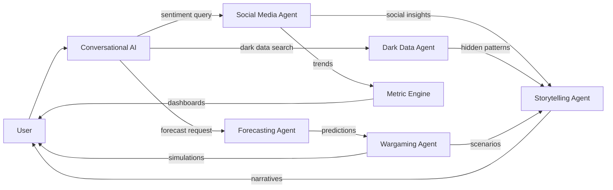

# Phase 2 Architecture Diagrams

Visual architecture diagrams for all Phase 2 skills: Social Media Intelligence, Wargaming, Self-Service Analytics, and Data Storytelling.

## Table of Contents

1. [System Overview](#system-overview)
2. [Social Media Intelligence](#social-media-intelligence-diagrams)
3. [Wargaming & Scenario Simulator](#wargaming-scenario-simulator-diagrams)
4. [Self-Service Analytics Builder](#self-service-analytics-builder-diagrams)
5. [Data Storytelling Engine](#data-storytelling-engine-diagrams)
6. [Phase 1 + Phase 2 Integration](#phase-1--phase-2-integration)

---

## System Overview

### Phase 2 High-Level Architecture

```
┌─────────────────────────────────────────────────────────────────────┐
│                         Phase 2 Skills Layer                         │
├─────────────┬───────────────┬──────────────────┬────────────────────┤
│   Social    │   Wargaming   │  Self-Service    │  Data Storytelling │
│   Media     │   Simulator   │  Analytics       │  Engine            │
│Intelligence │               │  Builder         │                    │
└─────────────┴───────────────┴──────────────────┴────────────────────┘
       │              │                │                   │
       ▼              ▼                ▼                   ▼
┌─────────────────────────────────────────────────────────────────────┐
│                         Phase 1 Skills Layer                         │
│  ┌──────────────┐  ┌──────────────┐  ┌─────────────────────────┐   │
│  │Conversational│  │ Forecasting  │  │    Dark Data Mining     │   │
│  │      AI      │  │   Analytics  │  │                         │   │
│  └──────────────┘  └──────────────┘  └─────────────────────────┘   │
└─────────────────────────────────────────────────────────────────────┘
       │                      │                        │
       ▼                      ▼                        ▼
┌─────────────────────────────────────────────────────────────────────┐
│                      Existing ConsultantOS Core                      │
│  Research │ Market │ Financial │ Framework │ Synthesis │ Monitoring │
└─────────────────────────────────────────────────────────────────────┘
```

### Component Dependencies

```mermaid
graph TB
    SM[Social Media Agent] --> BASE[BaseAgent]
    WG[Wargaming Agent] --> BASE
    ST[Storytelling Agent] --> BASE
    ME[Metric Engine] --> DB[Firestore]

    SM --> TC[Twitter Connector]
    SM --> LC[LinkedIn Connector]
    SM --> RC[Reddit Connector]

    WG --> GT[Game Tree Engine]
    WG --> MC[Monte Carlo Simulator]
    WG --> CM[Competitor Model]

    ST --> IE[Insight Extractor]
    ST --> NG[Narrative Generator]
    ST --> PA[Persona Adapter]

    ME --> FP[Formula Parser]
    ME --> QB[Query Builder]

    SM -.Integration.-> CONV[Conversational Agent]
    WG -.Integration.-> FORE[Forecasting Agent]
    ST -.Integration.-> DD[Dark Data Agent]
```



---

## Social Media Intelligence Diagrams

### 1. Social Media Monitoring Architecture

```
┌──────────────────────────────────────────────────────────────────┐
│                      External Platforms                          │
│  ┌────────┐    ┌──────────┐    ┌────────┐    ┌────────────┐    │
│  │Twitter │    │LinkedIn  │    │Reddit  │    │ YouTube    │    │
│  │  API   │    │   API    │    │  API   │    │   API      │    │
│  └────────┘    └──────────┘    └────────┘    └────────────┘    │
└──────┬────────────────┬──────────────┬──────────────┬───────────┘
       │                │              │              │
       ▼                ▼              ▼              ▼
┌──────────────────────────────────────────────────────────────────┐
│                   Platform Connectors Layer                       │
│  ┌──────────────┐  ┌──────────────┐  ┌─────────────────────┐    │
│  │Twitter       │  │LinkedIn      │  │Reddit               │    │
│  │Connector     │  │Connector     │  │Connector            │    │
│  │- Stream API  │  │- Webhooks    │  │- PRAW Integration   │    │
│  │- Rate Limit  │  │- OAuth2      │  │- Subreddit Monitor  │    │
│  └──────────────┘  └──────────────┘  └─────────────────────┘    │
└──────┬────────────────────────────────────────────────┬──────────┘
       │                                                 │
       ▼                                                 ▼
┌──────────────────────────────────────────────────────────────────┐
│                   SocialMediaAgent Core                           │
│  ┌──────────────────────────────────────────────────────────┐    │
│  │  1. Ingestion      → 2. Processing  → 3. Analysis        │    │
│  │  - Collect posts   │ - Deduplicate  │ - Sentiment       │    │
│  │  - Filter spam     │ - Extract      │ - Influencers     │    │
│  │  - Rate limit      │   entities     │ - Trends          │    │
│  └──────────────────────────────────────────────────────────┘    │
└──────┬────────────────────────────────────────────────┬──────────┘
       │                                                 │
       ▼                                                 ▼
┌─────────────────┐                            ┌──────────────────┐
│   Firestore     │                            │  Pub/Sub Queue   │
│ social_posts    │                            │  (Real-time)     │
│ social_monitors │                            │  Crisis Alerts   │
└─────────────────┘                            └──────────────────┘
```

### 2. Real-Time Social Streaming Pipeline

```
Twitter Stream ──┐
                 │
LinkedIn Events ─┼──▶ ┌────────────────┐
                 │    │  Rate Limiter  │
Reddit PRAW ─────┘    │  (per platform)│
                      └────────┬───────┘
                               │
                               ▼
                      ┌─────────────────┐
                      │ Deduplication   │
                      │ (hash + fuzzy)  │
                      └────────┬────────┘
                               │
                ┌──────────────┼──────────────┐
                ▼              ▼              ▼
        ┌───────────┐  ┌────────────┐ ┌─────────────┐
        │ Sentiment │  │  Entity    │ │ Engagement  │
        │ Analysis  │  │ Extraction │ │ Metrics     │
        │ (TextBlob)│  │  (spaCy)   │ │ Calculation │
        └─────┬─────┘  └─────┬──────┘ └──────┬──────┘
              │              │               │
              └──────────────┼───────────────┘
                             ▼
                    ┌─────────────────┐
                    │  Firestore DB   │
                    │  + Pub/Sub      │
                    │  (if crisis)    │
                    └─────────────────┘
```

### 3. Sentiment Analysis Flow

```
┌─────────────────────────────────────────────────────────────────┐
│                         Raw Social Post                          │
│  "Tesla's new Model Y is amazing! Best EV I've driven. #Tesla"  │
└─────────────────────────┬───────────────────────────────────────┘
                          │
                          ▼
                ┌──────────────────┐
                │  Text Cleaning   │
                │  - Remove URLs   │
                │  - Hashtags      │
                │  - Mentions      │
                └────────┬─────────┘
                         │
                         ▼
               ┌──────────────────────┐
               │ Sentiment Scoring    │
               │ (TextBlob / VADER)   │
               │ polarity: -1.0 to 1.0│
               └──────────┬───────────┘
                          │
          ┌───────────────┼───────────────┐
          ▼               ▼               ▼
    ┌─────────┐     ┌─────────┐     ┌─────────┐
    │Positive │     │ Neutral │     │Negative │
    │(> 0.1)  │     │±0.1     │     │(< -0.1) │
    │ 0.65    │     │         │     │         │
    └─────────┘     └─────────┘     └─────────┘
          │
          ▼
    ┌──────────────────────────┐
    │  Store with Metadata     │
    │  - sentiment_score: 0.65 │
    │  - category: positive    │
    │  - confidence: 0.82      │
    └──────────────────────────┘
```

### 4. Crisis Detection Logic

```
Continuous Monitoring
        │
        ▼
┌─────────────────────┐
│ Aggregate Metrics   │
│ (rolling 1-hour)    │
│                     │
│ - Total mentions    │
│ - Sentiment avg     │
│ - Negative %        │
│ - Velocity (Δ/hr)   │
└──────────┬──────────┘
           │
           ▼
    ┌──────────────────┐
    │ Threshold Check  │
    │                  │
    │ IF mentions > 100│
    │ AND negative > 40│
    │ AND velocity > 50│
    │                  │
    └────────┬─────────┘
             │
     YES ────┘
             │
             ▼
    ┌─────────────────────┐
    │ Crisis Alert        │
    │ confidence: 0.87    │
    │ severity: HIGH      │
    │                     │
    │ ┌─────────────────┐ │
    │ │ Pub/Sub Publish │ │
    │ │ Email/Slack     │ │
    │ └─────────────────┘ │
    └─────────────────────┘
```

---

## Wargaming & Scenario Simulator Diagrams

### 1. Wargaming System Architecture

```
┌──────────────────────────────────────────────────────────────────┐
│                        User Interface                             │
│  ┌────────────────┐  ┌─────────────┐  ┌────────────────────┐    │
│  │ Scenario       │  │ Simulation  │  │ Results Comparison │    │
│  │ Builder Form   │  │ Progress    │  │ Dashboard          │    │
│  └────────────────┘  └─────────────┘  └────────────────────┘    │
└──────────────────────────────┬───────────────────────────────────┘
                               │
                               ▼
┌──────────────────────────────────────────────────────────────────┐
│                     WarGamingAgent Core                           │
│  ┌──────────────────────────────────────────────────────────┐    │
│  │ 1. Game Tree     → 2. Monte Carlo  → 3. Analysis        │    │
│  │ Generation       │    Simulation    │                    │    │
│  │ - Build tree     │ - Run 1000 iter │ - Best/worst case  │    │
│  │ - Define moves   │ - Track outcomes│ - Confidence int   │    │
│  │ - Competitor     │ - Parallel exec │ - Visualizations   │    │
│  │   responses      │                 │                    │    │
│  └──────────────────────────────────────────────────────────┘    │
└──────┬────────────────────────────────────────────────┬──────────┘
       │                                                 │
       ▼                                                 ▼
┌─────────────────┐                            ┌──────────────────┐
│   Firestore     │                            │  Cloud Tasks     │
│  scenarios      │                            │  (async sims)    │
│  simulations    │                            │                  │
└─────────────────┘                            └──────────────────┘
```

### 2. Game Tree Generation

```
Player Move: "Price Cut 10%"
         │
         ├─────────────────┬─────────────────┬──────────────────┐
         ▼                 ▼                 ▼                  ▼
   Competitor A      Competitor B      Competitor A      Competitor B
   Match Price       Quality Upgrade   Marketing Boost   No Action
   (40% prob)        (20% prob)        (30% prob)        (10% prob)
         │                 │                 │                  │
         ├─────────┬───────┴─────────┬───────┴────────┬─────────┘
         ▼         ▼                 ▼                ▼
    Player M2  Player M2         Player M2        Player M2
    Counter    Counter           Counter          Counter
    (Branch A) (Branch B)        (Branch C)       (Branch D)

Total Paths: 4 competitors × 4 responses × 3 moves = 48 scenarios
Monte Carlo: Sample 1000 random paths through tree
```

### 3. Monte Carlo Simulation Flow

```
Scenario Definition
  ├─ Action: "price_cut_10_percent"
  ├─ Baseline Market Share: 25%
  └─ Competitors: [A, B, C]
         │
         ▼
┌────────────────────────────┐
│ FOR i in 1..1000:          │
│                            │
│  1. Initial Player Move    │
│     market_share += gain   │
│     revenue *= (1 - 0.10)  │
│                            │
│  2. Competitor Responses   │
│     FOR each competitor:   │
│       response = random()  │
│       adjust market_share  │
│                            │
│  3. Store Outcome          │
│     success: bool          │
│     final_share: float     │
│     revenue_impact: float  │
│                            │
└─────────────┬──────────────┘
              │
              ▼
      Aggregate Results
      ├─ Success Rate: 68%
      ├─ Expected Share: 28%
      ├─ Revenue Impact: -3%
      ├─ Best Case: +12% revenue
      ├─ Worst Case: -18% revenue
      └─ Confidence: [5th, 95th] percentile
```

### 4. Competitor Response Modeling

```
┌────────────────────────────────────────────────────────────┐
│            Competitor Behavioral Model                     │
├────────────────────────────────────────────────────────────┤
│                                                            │
│  ┌──────────────────────────────────────────────────┐     │
│  │ Historical Analysis (from Dark Data Mining)      │     │
│  │ - Past price responses                           │     │
│  │ - Product launch reactions                       │     │
│  │ - Marketing strategy patterns                    │     │
│  └────────────────────┬─────────────────────────────┘     │
│                       │                                    │
│                       ▼                                    │
│  ┌──────────────────────────────────────────────────┐     │
│  │ LLM-Based Prediction (Gemini)                    │     │
│  │                                                  │     │
│  │ Prompt: "Given Competitor A historically..."    │     │
│  │ "...how likely are they to match our price?"    │     │
│  │                                                  │     │
│  │ Response: JSON with probabilities               │     │
│  │ {                                                │     │
│  │   "match_price": 0.45,                          │     │
│  │   "quality_upgrade": 0.25,                      │     │
│  │   "marketing_boost": 0.20,                      │     │
│  │   "no_action": 0.10                             │     │
│  │ }                                                │     │
│  └────────────────────┬─────────────────────────────┘     │
│                       │                                    │
│                       ▼                                    │
│           Use in Monte Carlo Sampling                      │
└────────────────────────────────────────────────────────────┘
```

---

## Self-Service Analytics Builder Diagrams

### 1. Analytics Builder Architecture

```
┌──────────────────────────────────────────────────────────────────┐
│                       Frontend (Next.js)                          │
│  ┌────────────────────────────────────────────────────────────┐  │
│  │             Dashboard Canvas (Drag & Drop)                 │  │
│  │  ┌──────┐  ┌──────┐  ┌──────┐  ┌──────┐  ┌──────┐        │  │
│  │  │Chart1│  │Chart2│  │KPI   │  │Table │  │Filter│        │  │
│  │  └──────┘  └──────┘  └──────┘  └──────┘  └──────┘        │  │
│  └────────────────────────────────────────────────────────────┘  │
│  ┌────────────────────────────────────────────────────────────┐  │
│  │                 Widget Library (Sidebar)                   │  │
│  │  📊 Line Chart │ 📈 Bar Chart │ 🥧 Pie Chart │ 🔢 KPI      │  │
│  │  📋 Table │ 🔍 Filter │ 📅 Date Range │ ⬇️ Export          │  │
│  └────────────────────────────────────────────────────────────┘  │
│  ┌────────────────────────────────────────────────────────────┐  │
│  │              Metric Editor (Formula Builder)               │  │
│  │  Formula: [revenue] / [customers]                          │  │
│  │  Preview: ✅ Valid | Data Source: analysis_snapshots       │  │
│  └────────────────────────────────────────────────────────────┘  │
└──────────────────────────────┬───────────────────────────────────┘
                               │ REST API
                               ▼
┌──────────────────────────────────────────────────────────────────┐
│                     Backend (FastAPI)                             │
│  ┌────────────────┐  ┌────────────────┐  ┌────────────────────┐ │
│  │ Metric Engine  │  │ Query Builder  │  │ Dashboard Manager  │ │
│  │ - Parse formula│  │ - Build SQL    │  │ - CRUD operations  │ │
│  │ - Validate     │  │ - Execute      │  │ - Access control   │ │
│  └────────────────┘  └────────────────┘  └────────────────────┘ │
└──────────────────────────────┬───────────────────────────────────┘
                               │
                               ▼
                      ┌─────────────────┐
                      │   Firestore     │
                      │  dashboards     │
                      │  widgets        │
                      │  metrics        │
                      └─────────────────┘
```

### 2. Metric Formula Processing Pipeline

```
User Input: "growth_rate = (revenue_t1 - revenue_t0) / revenue_t0 * 100"
         │
         ▼
┌─────────────────────┐
│  Formula Parser     │
│  (SymPy)            │
│  - Tokenize         │
│  - Extract variables│
│  - Validate syntax  │
└──────────┬──────────┘
           │
           ▼
Variables: [revenue_t1, revenue_t0]
           │
           ▼
┌─────────────────────────────┐
│  Data Source Mapping        │
│  revenue_t1 → snapshots.    │
│                revenue      │
│                (latest)     │
│  revenue_t0 → snapshots.    │
│                revenue      │
│                (previous)   │
└──────────┬──────────────────┘
           │
           ▼
┌──────────────────────────────┐
│  Query Builder               │
│  SELECT                      │
│    s1.revenue as revenue_t1, │
│    s0.revenue as revenue_t0  │
│  FROM snapshots s1           │
│  JOIN snapshots s0           │
│  WHERE s1.timestamp > ...    │
└──────────┬───────────────────┘
           │
           ▼
┌──────────────────────────────┐
│  Execute Query               │
│  ┌────────────────────────┐  │
│  │ revenue_t1: 105.2M     │  │
│  │ revenue_t0: 98.5M      │  │
│  └────────────────────────┘  │
└──────────┬───────────────────┘
           │
           ▼
┌──────────────────────────────┐
│  Evaluate Formula            │
│  growth_rate =               │
│    (105.2 - 98.5) / 98.5 * 100│
│  = 6.8%                      │
└──────────────────────────────┘
```

### 3. Dashboard Layout System

```
┌────────────────────────────────────────────────────────────────┐
│                     Dashboard Canvas (Grid)                     │
│                                                                 │
│  ┌─────────────────────┐  ┌─────────────────────┐             │
│  │ Widget 1            │  │ Widget 2            │             │
│  │ Type: Line Chart    │  │ Type: KPI Card      │             │
│  │ Position: (0,0)     │  │ Position: (2,0)     │             │
│  │ Size: 2x2           │  │ Size: 1x1           │             │
│  │                     │  │                     │             │
│  │  [Chart Rendering]  │  │  Revenue: $105.2M   │             │
│  │                     │  │  ↑ 6.8% YoY         │             │
│  └─────────────────────┘  └─────────────────────┘             │
│                                                                 │
│  ┌──────────────────────────────────────────┐                  │
│  │ Widget 3                                 │                  │
│  │ Type: Data Table                         │                  │
│  │ Position: (0,2)                          │                  │
│  │ Size: 3x2                                │                  │
│  │                                          │                  │
│  │  Company    | Market Share | Sentiment  │                  │
│  │  Tesla      | 28%          | +0.65      │                  │
│  │  Rivian     | 12%          | +0.42      │                  │
│  └──────────────────────────────────────────┘                  │
│                                                                 │
└────────────────────────────────────────────────────────────────┘

Grid System: 12 columns × infinite rows
Widget Placement: (col, row, width, height)
Drag & Drop: react-grid-layout library
Responsive: Breakpoints for mobile/tablet/desktop
```

### 4. Real-Time Data Refresh

```
Dashboard Load
      │
      ▼
┌─────────────────┐
│ Initial Fetch   │
│ (all widgets)   │
└────────┬────────┘
         │
         ▼
  ┌──────────────┐
  │ WebSocket    │
  │ Connection   │
  │ (optional)   │
  └──────┬───────┘
         │
         ▼
┌────────────────────────┐
│ Polling Loop           │
│ (30 second interval)   │
│                        │
│ FOR each widget:       │
│   - Fetch new data     │
│   - Compare with cache │
│   - Update if changed  │
│                        │
└──────────┬─────────────┘
           │
           ▼
    ┌─────────────┐
    │ UI Update   │
    │ (React)     │
    └─────────────┘
```

---

## Data Storytelling Engine Diagrams

### 1. Storytelling System Architecture

```
┌──────────────────────────────────────────────────────────────────┐
│                      Analysis Data Input                          │
│  ┌────────────┐  ┌────────────┐  ┌──────────────────────────┐   │
│  │ Market     │  │ Financial  │  │ Social Media             │   │
│  │ Analysis   │  │ Metrics    │  │ Insights                 │   │
│  └────────────┘  └────────────┘  └──────────────────────────┘   │
└──────────────────────────────┬───────────────────────────────────┘
                               │
                               ▼
┌──────────────────────────────────────────────────────────────────┐
│                   StorytellingAgent Core                          │
│  ┌──────────────────────────────────────────────────────────┐    │
│  │ 1. Insight       → 2. Narrative    → 3. Persona          │    │
│  │ Extraction       │    Generation    │    Adaptation      │    │
│  │ - Key metrics    │ - LLM prompt     │ - CEO focus        │    │
│  │ - Trends         │ - Story arc      │ - CMO focus        │    │
│  │ - Anomalies      │ - Tone control   │ - CFO focus        │    │
│  └──────────────────────────────────────────────────────────┘    │
└──────┬────────────────────────────────────────────────┬──────────┘
       │                                                 │
       ▼                                                 ▼
┌─────────────────┐                            ┌──────────────────┐
│  Multi-Format   │                            │  Brand Voice     │
│  Export         │                            │  Templates       │
│  - Markdown     │                            │  - Formal        │
│  - PowerPoint   │                            │  - Casual        │
│  - Video Script │                            │  - Technical     │
└─────────────────┘                            └──────────────────┘
```

### 2. Insight Extraction Pipeline

```
Raw Analysis Data
  ├─ Market Share: 28% (+3pp YoY)
  ├─ Revenue Growth: 15% QoQ
  ├─ Sentiment: 0.65 (positive)
  └─ Competitor A launched Product X
         │
         ▼
┌───────────────────────────┐
│  Statistical Analysis     │
│  - Identify trends        │
│  - Calculate deltas       │
│  - Rank by significance   │
└─────────────┬─────────────┘
              │
              ▼
┌────────────────────────────────┐
│  Pattern Recognition           │
│  - Growth trajectory: sustained│
│  - Market position: leader     │
│  - Competitive threat: moderate│
└─────────────┬──────────────────┘
              │
              ▼
┌────────────────────────────────┐
│  Insight Prioritization        │
│  1. Market share gains (HIGH)  │
│  2. Positive sentiment (MED)   │
│  3. Competitor threat (MED)    │
│  4. Revenue growth (HIGH)      │
└─────────────┬──────────────────┘
              │
              ▼
        Top 3-5 Insights
        (feed to narrative generator)
```

### 3. Persona-Based Narrative Generation

```
Insights + Persona Selection
         │
         ├──────────┬──────────┬──────────┬──────────┐
         ▼          ▼          ▼          ▼          ▼
     ┌────┐     ┌────┐     ┌────┐     ┌─────┐   ┌──────┐
     │CEO │     │CMO │     │CFO │     │Board│   │Analyst│
     └─┬──┘     └─┬──┘     └─┬──┘     └──┬──┘   └───┬──┘
       │          │          │           │          │
       ▼          ▼          ▼           ▼          ▼
   Strategic  Marketing  Financial  Governance Technical
    Focus      Focus     Focus       Focus      Focus
       │          │          │           │          │
       └──────────┴──────────┴───────────┴──────────┘
                          │
                          ▼
                ┌──────────────────┐
                │ Persona Prompt   │
                │ Engineering      │
                │                  │
                │ CEO Template:    │
                │ "Focus on..."    │
                │ - Strategy       │
                │ - Competition    │
                │ - Business impact│
                │                  │
                │ CMO Template:    │
                │ "Emphasize..."   │
                │ - Customer       │
                │ - Brand          │
                │ - Marketing opps │
                └────────┬─────────┘
                         │
                         ▼
                ┌─────────────────┐
                │ LLM Generation  │
                │ (Gemini 1.5)    │
                │ - Structured    │
                │ - 500 words     │
                │ - 3-5 insights  │
                │ - 3 actions     │
                └────────┬────────┘
                         │
                         ▼
                  Final Narrative
```

### 4. Multi-Format Export Flow

```
Generated Narrative
  ├─ Executive Summary
  ├─ Key Insights (bullets)
  ├─ Full Narrative (500 words)
  └─ Recommendations (3 actions)
         │
         ├──────────┬──────────┬──────────────┐
         ▼          ▼          ▼              ▼
    ┌────────┐ ┌────────┐ ┌──────────┐ ┌────────────┐
    │Markdown│ │PowerPt │ │   Word   │ │Video Script│
    └────┬───┘ └───┬────┘ └────┬─────┘ └──────┬─────┘
         │         │           │              │
         ▼         ▼           ▼              ▼
     .md file  .pptx file  .docx file    .txt file
      (GitHub) (python-pptx)(python-docx) (formatted)
         │         │           │              │
         │         │           │              │
         └─────────┴───────────┴──────────────┘
                          │
                          ▼
              ┌───────────────────────┐
              │ Download / Email      │
              │ User receives:        │
              │ - Markdown (preview)  │
              │ - PPTX (presentation) │
              │ - DOCX (document)     │
              │ - Video script (TTS)  │
              └───────────────────────┘
```

---

## Phase 1 + Phase 2 Integration

### 1. Cross-Phase Workflows



### 2. Conversational AI + Social Media Integration

```
User Query: "What are customers saying about our latest product?"
         │
         ▼
┌────────────────────────┐
│ ConversationalAgent    │
│ - Parse intent         │
│ - Identify keywords:   │
│   ["customers",        │
│    "saying",           │
│    "product"]          │
│ - Route to Social      │
└──────────┬─────────────┘
           │
           ▼
┌────────────────────────┐
│ SocialMediaAgent       │
│ - Company: extracted   │
│ - Timeframe: 24h       │
│ - Platforms: all       │
│ - Execute analysis     │
└──────────┬─────────────┘
           │
           ▼
┌────────────────────────────────┐
│ Results                        │
│ - 127 mentions                 │
│ - Sentiment: +0.58 (positive)  │
│ - Top themes:                  │
│   1. "battery life" (positive) │
│   2. "price" (mixed)           │
│   3. "design" (very positive)  │
└──────────┬─────────────────────┘
           │
           ▼
┌──────────────────────────────────────┐
│ ConversationalAgent (Response)       │
│                                      │
│ "Recent social analysis shows 127   │
│ customer mentions with positive     │
│ sentiment (0.58). Top themes:       │
│ • Battery life praised              │
│ • Price concerns (mixed reactions)  │
│ • Design highly praised             │
│                                      │
│ Would you like me to dig deeper     │
│ into the price feedback?"           │
└──────────────────────────────────────┘
```

### 3. Forecasting + Wargaming Integration

```
Baseline Forecast (ForecastingAgent)
  ├─ Market Share: [25%, 26%, 27%, 28%, 29%, 30%]
  ├─ Revenue: [98M, 102M, 106M, 110M, 115M, 120M]
  └─ Confidence Intervals
         │
         ▼
┌────────────────────────┐
│ Scenario Definition    │
│ - Action: "Price cut"  │
│ - Baseline: Forecast   │
└──────────┬─────────────┘
           │
           ▼
┌────────────────────────────────┐
│ WarGamingAgent                 │
│ - Use forecast as baseline     │
│ - Simulate competitive moves   │
│ - Calculate delta from forecast│
└──────────┬───────────────────────┘
           │
           ▼
┌────────────────────────────────────────┐
│ Simulation Results                     │
│                                        │
│ Baseline (Forecast):                   │
│   Market Share: 28% → 30%              │
│   Revenue: $110M → $120M               │
│                                        │
│ With Price Cut (Wargaming):            │
│   Expected Share: 31% (+1pp vs base)   │
│   Expected Revenue: $117M (-2.5% vs)   │
│   Success Rate: 72%                    │
│                                        │
│ Insight: Price cut gains share but    │
│ hurts revenue vs baseline forecast.    │
└────────────────────────────────────────┘
```

### 4. Dark Data + Storytelling Integration

```
Dark Data Mining Results
  ├─ Email: 45 customer complaints re: Product X
  ├─ Slack: Engineering concerns about quality
  └─ Drive: Internal memo re: manufacturing delays
         │
         ▼
┌────────────────────────┐
│ Insight Extraction     │
│ - Risk: Quality issues │
│ - Sentiment: Negative  │
│ - Urgency: HIGH        │
└──────────┬─────────────┘
           │
           ▼
┌─────────────────────────────────┐
│ StorytellingAgent               │
│ - Persona: CEO                  │
│ - Tone: Formal + Urgent         │
│ - Focus: Risk mitigation        │
└──────────┬──────────────────────┘
           │
           ▼
┌──────────────────────────────────────────────────┐
│ Generated Narrative                              │
│                                                  │
│ EXECUTIVE SUMMARY                                │
│ Internal signals indicate emerging quality       │
│ concerns with Product X that require immediate   │
│ attention. Customer complaints (45), engineering │
│ feedback, and manufacturing delays suggest a     │
│ systemic issue.                                  │
│                                                  │
│ KEY INSIGHTS                                     │
│ 1. Customer complaints increased 3x in 30 days   │
│ 2. Engineering team identified root cause        │
│ 3. Manufacturing delays contributing to pressure │
│                                                  │
│ RECOMMENDATIONS                                  │
│ 1. Immediate quality audit of Product X         │
│ 2. Transparent communication to customers        │
│ 3. Delay upcoming launch until issues resolved   │
└──────────────────────────────────────────────────┘
```

### 5. Complete End-to-End Workflow

```
┌──────────────────────────────────────────────────────────────────┐
│                         User Action                               │
│  "Create comprehensive competitive report for Tesla with         │
│   social sentiment, market forecast, and scenario simulation"    │
└──────────────────────────┬───────────────────────────────────────┘
                           │
                           ▼
                  ┌─────────────────┐
                  │ Orchestrator    │
                  │ (parallel exec) │
                  └────────┬────────┘
                           │
         ┌─────────────────┼─────────────────┐
         ▼                 ▼                 ▼
┌─────────────────┐ ┌─────────────┐ ┌─────────────────┐
│Social Media     │ │Forecasting  │ │Dark Data Mining │
│Agent            │ │Agent        │ │                 │
│(Phase 2)        │ │(Phase 1)    │ │(Phase 1)        │
└────────┬────────┘ └──────┬──────┘ └────────┬────────┘
         │                 │                 │
         └─────────────────┼─────────────────┘
                           ▼
                  ┌─────────────────┐
                  │ Wargaming Agent │
                  │ (Phase 2)       │
                  │ - Use forecast  │
                  │   as baseline   │
                  └────────┬────────┘
                           │
                           ▼
                  ┌─────────────────┐
                  │ Storytelling    │
                  │ Agent (Phase 2) │
                  │ - Synthesize    │
                  │   all insights  │
                  └────────┬────────┘
                           │
                           ▼
                  ┌─────────────────────────┐
                  │ Final Report            │
                  │ - Social insights       │
                  │ - Market forecast       │
                  │ - Scenario analysis     │
                  │ - Executive narrative   │
                  │ - Multi-format export   │
                  └─────────────────────────┘
```

---

## Database Schema (Firestore Collections)

### Phase 2 Collections

```
social_monitors/
├─ {monitor_id}
│  ├─ user_id: string
│  ├─ company: string
│  ├─ platforms: array<string>
│  ├─ keywords: array<string>
│  ├─ created_at: timestamp
│  └─ active: boolean

social_posts/
├─ {post_id}
│  ├─ monitor_id: string
│  ├─ platform: enum(twitter, linkedin, reddit)
│  ├─ author_id: string
│  ├─ content: string
│  ├─ sentiment_score: float (-1 to 1)
│  ├─ engagement_metrics: map
│  ├─ created_at: timestamp
│  └─ indexed_at: timestamp

scenarios/
├─ {scenario_id}
│  ├─ user_id: string
│  ├─ name: string
│  ├─ action: string
│  ├─ baseline_market_share: float
│  ├─ competitors: array<string>
│  ├─ created_at: timestamp
│  └─ last_run: timestamp

simulations/
├─ {simulation_id}
│  ├─ scenario_id: string
│  ├─ num_simulations: int
│  ├─ success_rate: float
│  ├─ expected_market_share: float
│  ├─ expected_revenue_impact: float
│  ├─ confidence_interval: array<float>
│  └─ created_at: timestamp

dashboards/
├─ {dashboard_id}
│  ├─ user_id: string
│  ├─ name: string
│  ├─ description: string
│  ├─ widgets: array<widget>
│  │  ├─ type: enum(chart, kpi, table, filter)
│  │  ├─ config: map
│  │  └─ position: {x, y, width, height}
│  ├─ created_at: timestamp
│  └─ updated_at: timestamp

narratives/
├─ {narrative_id}
│  ├─ report_id: string (optional)
│  ├─ target_audience: enum(CEO, CMO, CFO, Board)
│  ├─ tone: enum(formal, casual, technical)
│  ├─ executive_summary: string
│  ├─ key_insights: array<string>
│  ├─ full_text: string
│  ├─ recommendations: array<string>
│  └─ generated_at: timestamp
```

---

**Document Version**: 1.0
**Last Updated**: November 9, 2025
**Total Diagrams**: 24 (ASCII + Mermaid)
